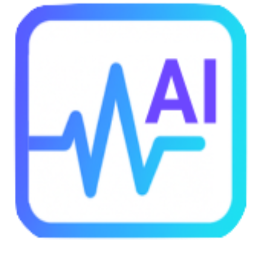

# Progonomix 🏥🤖

<div align="center">



### AI-Powered Medical Companion Platform

**Transform your clinical workflow with intelligent automation, voice transcription, and advanced diagnostic assistance.**

[](https://opensource.org/licenses/MIT)
[](https://reactjs.org/)
[](https://www.typescriptlang.org/)
[](https://tailwindcss.com/)
[](https://vercel.com/)

[🚀 Live Demo](https://progonomix.vercel.app) | [📖 Documentation](#documentation) | [🤝 Contributing](#contributing) | [🐛 Report Bug](https://github.com/yourusername/progonomix/issues)

</div>

---

## 🌟 Overview

Progonomix is a revolutionary **AI-powered healthcare management platform** that streamlines clinical workflows through intelligent automation. Built for healthcare professionals, it reduces documentation time by **70%** while improving diagnostic accuracy and patient care quality.

### ✨ Key Features

- 🎙️ **Voice-to-Text SOAP Notes** - Real-time transcription with medical terminology optimization
- 🧠 **AI Diagnostic Assistant** - Advanced symptom analysis and differential diagnosis suggestions
- 🔬 **Medical Imaging Analysis** - Automated scan interpretation with urgency assessment
- 👥 **Patient Management** - Comprehensive medical records with smart organization
- ⚡ **Critical Case Detection** - Intelligent alerts for high-priority patients
- 💊 **Drug Interaction Checking** - Automated medication safety analysis
- 📊 **Biometrics Tracking** - Advanced health metrics monitoring and analysis
- 🧬 **DNA Analysis Integration** - Genetic data interpretation for personalized medicine
- 📱 **Progressive Web App** - Works seamlessly across desktop and mobile devices

---

## 🎯 Problem & Solution

### The Challenge
Healthcare professionals spend **60-70% of their time** on documentation rather than patient care, leading to:
- Physician burnout and reduced job satisfaction
- Increased medical errors due to rushed documentation
- Delayed diagnosis and treatment decisions
- Poor patient experience due to reduced face-to-face time

### Our Solution
Progonomix leverages cutting-edge AI to automate clinical workflows:
- **Voice transcription** eliminates manual typing
- **AI diagnostic assistance** provides real-time clinical decision support
- **Automated medical imaging analysis** accelerates radiology workflows
- **Smart patient management** organizes and prioritizes care delivery

---

## 🛠️ Technology Stack

### Frontend
- **React 19.1.1** - Modern UI library with concurrent features
- **TypeScript 4.9.5** - Type-safe development
- **Tailwind CSS 3.4.17** - Utility-first styling framework
- **Lucide React** - Beautiful, customizable icons
- **React Router DOM 7.9.1** - Client-side routing

### AI & APIs
- **Google Gemini AI 2.5-pro** - Advanced language model for medical analysis
- **Deepgram SDK** - Real-time voice transcription
- **Custom AI Services** - Specialized medical diagnostic algorithms

### Backend & Database
- **Supabase** - Backend-as-a-Service with PostgreSQL
- **Real-time subscriptions** - Live data synchronization
- **Row Level Security** - HIPAA-compliant data protection
- **File storage** - Secure medical imaging storage

### Development & Deployment
- **Create React App** - Optimized build toolchain
- **Vercel** - Serverless deployment platform
- **ESLint & Prettier** - Code quality and formatting
- **Git** - Version control

---

## 🚀 Quick Start

### Prerequisites
- **Node.js** 16.0+ and npm 8.0+
- **Git** for version control
- **Supabase account** (free tier available)
- **Google AI Studio API key** (for Gemini AI)
- **Deepgram API key** (for voice transcription)

### Installation

1. **Clone the repository**
   ```bash
   git clone https://github.com/yourusername/progonomix.git
   cd progonomix
   ```

2. **Install dependencies**
   ```bash
   npm install
   ```

3. **Environment setup**
   Create a `.env.local` file in the root directory:
   ```env
   # Supabase Configuration
   REACT_APP_SUPABASE_URL=your_supabase_project_url
   REACT_APP_SUPABASE_ANON_KEY=your_supabase_anon_key
   
   # Google Gemini AI
   REACT_APP_GEMINI_API_KEY=your_gemini_api_key
   
   # Deepgram (Voice Transcription)
   REACT_APP_DEEPGRAM_API_KEY=your_deepgram_api_key
   ```

4. **Database setup**
   ```bash
   # Run the provided SQL schema in your Supabase dashboard
   # Files: /database/schema.sql, /database/seed.sql
   ```

5. **Start development server**
   ```bash
   npm start
   ```

6. **Build for production**
   ```bash
   npm run build
   ```

### 🔧 Configuration Guide

<details>
<summary><strong>Supabase Setup</strong></summary>

1. Create a new project at [supabase.com](https://supabase.com)
2. Go to Settings → API to get your URL and anon key
3. In the SQL Editor, run the schema file: `database/schema.sql`
4. Enable Row Level Security for all tables
5. Configure authentication providers if needed

</details>

<details>
<summary><strong>AI Services Setup</strong></summary>

**Google Gemini AI:**
1. Visit [Google AI Studio](https://aistudio.google.com/)
2. Create an API key
3. Add to your `.env.local` file

**Deepgram:**
1. Sign up at [deepgram.com](https://deepgram.com/)
2. Get your API key from the dashboard
3. Add to your `.env.local` file

</details>

---

## 📚 Documentation

### Core Features

#### 🎙️ Voice-to-Text SOAP Notes
Convert clinical conversations into structured SOAP notes automatically:
```typescript
// Real-time transcription with medical terminology
const handleVoiceTranscript = async (audioBlob: Blob) => {
  const transcript = await DeepgramService.transcribeAudio(audioBlob);
  const soapNote = await GeminiService.generateSOAPFromTranscript(transcript);
  return soapNote;
};
```

#### 🧠 AI Diagnostic Assistant
Get intelligent diagnostic suggestions based on symptoms:
```typescript
// AI-powered diagnostic analysis
const getDiagnosticSuggestions = async (symptoms: string, patientData: PatientData) => {
  const suggestions = await GeminiService.provideDiagnosticSuggestions(symptoms, patientData);
  return suggestions; // Array of potential diagnoses ranked by likelihood
};
```

#### 🔬 Medical Imaging Analysis
Automated analysis of medical scans with urgency assessment:
```typescript
// AI scan analysis with systematic protocols
const analyzeMedicalScan = async (imageData: string, scanType: ScanType) => {
  const analysis = await GeminiService.analyzeMedicalScan(imageData, scanType);
  return {
    findings: analysis.findings,        // Specific medical findings
    urgencyLevel: analysis.urgency,     // Critical/High/Medium/Low
    recommendations: analysis.recommendations
  };
};
```

### API Reference

<details>
<summary><strong>Patient Management API</strong></summary>

```typescript
// Create new patient
const patient = await PatientService.createPatient(patientData);

// Get patient with medical history
const patientHistory = await PatientService.getPatientHistory(patientId);

// Generate AI summary
const summary = await PatientService.generatePatientSummary(patientId);

// Identify critical cases
const criticalCases = await PatientService.getCriticalCases();
```

</details>

<details>
<summary><strong>SOAP Notes API</strong></summary>

```typescript
// Create SOAP note
const soapNote = await SOAPService.createSOAPNote(noteData);

// Generate from voice transcript
const generatedNote = await SOAPService.generateSOAPFromTranscript(transcriptId, patientHistory);

// Get today's notes
const todaysNotes = await SOAPService.getTodaysSOAPNotes();
```

</details>

<details>
<summary><strong>Medical Scans API</strong></summary>

```typescript
// Upload and analyze scan
const scan = await MedicalScanService.uploadScan(file, patientId, scanType);

// Get pending scans (high/critical urgency)
const pendingScans = await MedicalScanService.getPendingScans();

// Update with radiologist notes
const updatedScan = await MedicalScanService.updateRadiologistNotes(scanId, notes);
```

</details>

---

## 🏗️ Architecture

### System Architecture
```
┌─────────────────┐    ┌──────────────────┐    ┌─────────────────┐
│   React Client  │────│   Supabase API   │────│   PostgreSQL    │
│   (Frontend)    │    │   (Backend)      │    │   (Database)    │
└─────────────────┘    └──────────────────┘    └─────────────────┘
         │                        │
         │                        │
         ▼                        ▼
┌─────────────────┐    ┌──────────────────┐
│   AI Services   │    │   File Storage   │
│ Gemini/Deepgram │    │   (Medical Scans)│
└─────────────────┘    └──────────────────┘
```

### Data Flow
1. **User Interaction** → React components handle UI state
2. **Voice Input** → Deepgram transcribes to text
3. **AI Processing** → Gemini analyzes and generates medical content
4. **Data Storage** → Supabase manages structured data
5. **Real-time Updates** → WebSocket subscriptions for live data

### Security & Compliance
- 🔒 **Row Level Security** - Database-level access control
- 🛡️ **HIPAA Compliance** - Secure handling of medical data
- 🔐 **API Key Management** - Secure credential storage
- 🚫 **No PII in Logs** - Privacy-first logging approach

---

## 🤝 Contributing

We welcome contributions from the community! Here's how you can help:

### Getting Started
1. 🍴 **Fork the repository**
2. 🌿 **Create a feature branch**: `git checkout -b feature/amazing-feature`
3. 💻 **Make your changes**
4. ✅ **Run tests**: `npm test`
5. 🏗️ **Build the project**: `npm run build`
6. 📝 **Commit changes**: `git commit -m 'Add amazing feature'`
7. 🚀 **Push to branch**: `git push origin feature/amazing-feature`
8. 🔄 **Open a Pull Request**

### Development Guidelines
- **Code Style**: Follow the existing TypeScript and React patterns
- **Testing**: Write tests for new features
- **Documentation**: Update README and inline docs
- **Commits**: Use conventional commit messages
- **Issues**: Check existing issues before creating new ones

### Areas for Contribution
- 🩺 **Medical Features** - New clinical tools and workflows
- 🤖 **AI Improvements** - Enhanced diagnostic algorithms
- 🎨 **UI/UX** - Better user experience and accessibility
- 🔧 **DevOps** - Improved deployment and monitoring
- 📖 **Documentation** - Better guides and examples
- 🧪 **Testing** - Increased test coverage
- 🌍 **Internationalization** - Multi-language support

---

## 📊 Project Status

### Current Version: `v0.1.0` (Beta)

### ✅ Completed Features
- [x] Patient management system
- [x] Voice-to-text SOAP notes
- [x] AI diagnostic assistant
- [x] Medical imaging analysis
- [x] Critical case detection
- [x] Drug interaction checking
- [x] Biometrics tracking
- [x] Progressive Web App
- [x] Responsive design
- [x] SEO optimization

### 🚧 In Development
- [ ] Multi-language support
- [ ] Advanced reporting dashboard
- [ ] Integration with EHR systems
- [ ] Mobile app (React Native)
- [ ] Offline functionality
- [ ] Advanced analytics

### 🎯 Roadmap
- **Q1 2025**: EHR integrations (Epic, Cerner)
- **Q2 2025**: Mobile applications
- **Q3 2025**: Advanced AI models
- **Q4 2025**: Telemedicine features

---

## 📄 License

This project is licensed under the **MIT License** - see the [LICENSE](LICENSE) file for details.

```
MIT License

Copyright (c) 2025 Progonomix

Permission is hereby granted, free of charge, to any person obtaining a copy
of this software and associated documentation files (the "Software"), to deal
in the Software without restriction, including without limitation the rights
to use, copy, modify, merge, publish, distribute, sublicense, and/or sell
copies of the Software, and to permit persons to whom the Software is
furnished to do so, subject to the following conditions:

The above copyright notice and this permission notice shall be included in all
copies or substantial portions of the Software.

THE SOFTWARE IS PROVIDED "AS IS", WITHOUT WARRANTY OF ANY KIND, EXPRESS OR
IMPLIED, INCLUDING BUT NOT LIMITED TO THE WARRANTIES OF MERCHANTABILITY,
FITNESS FOR A PARTICULAR PURPOSE AND NONINFRINGEMENT. IN NO EVENT SHALL THE
AUTHORS OR COPYRIGHT HOLDERS BE LIABLE FOR ANY CLAIM, DAMAGES OR OTHER
LIABILITY, WHETHER IN AN ACTION OF CONTRACT, TORT OR OTHERWISE, ARISING FROM,
OUT OF OR IN CONNECTION WITH THE SOFTWARE OR THE USE OR OTHER DEALINGS IN THE
SOFTWARE.
```

---

## 🙏 Acknowledgments

- **Google AI** for the Gemini API
- **Deepgram** for voice transcription services
- **Supabase** for the backend infrastructure
- **React Team** for the amazing framework
- **Healthcare Professionals** who provided feedback and requirements
- **Open Source Community** for inspiration and contributions

---

## 📞 Support & Contact

### Community
- 💬 **Discussions**: [GitHub Discussions](https://github.com/yourusername/progonomix/discussions)
- 🐛 **Issues**: [GitHub Issues](https://github.com/yourusername/progonomix/issues)
- 📧 **Email**: support@progonomix.com

### Professional Support
For enterprise deployments, custom integrations, or professional support:
- 🏢 **Enterprise**: enterprise@progonomix.com
- 💼 **Partnerships**: partnerships@progonomix.com

---

<div align="center">

### ⭐ Star us on GitHub — it motivates us a lot!

[⬆ Back to Top](#progonomix-)

**Made with ❤️ for healthcare professionals worldwide**

</div>